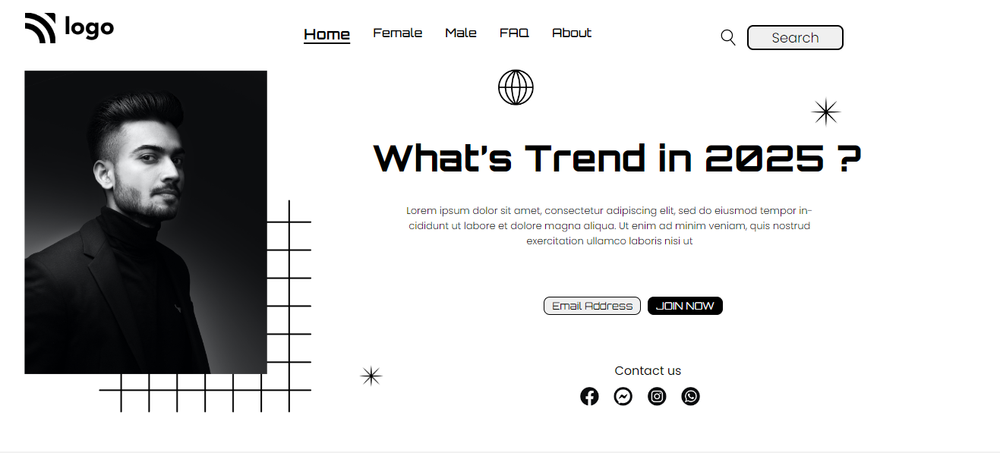

## My Name is Ajay.
## Project 2 from web dev bootcamp - Ineuron
# [Live website Link](https://trend-design.netlify.app/)
### In this project, I learnt a lot about positioning. This being the very first project, initially I thought I could not get the website to look exactly like the provided image, but I am glad that I could complete the website and make it look almost identical to the image provided. This was all about using CSS the right way.
### Time Taken to complete the prject: 3 hours.

### Website Preview:-

